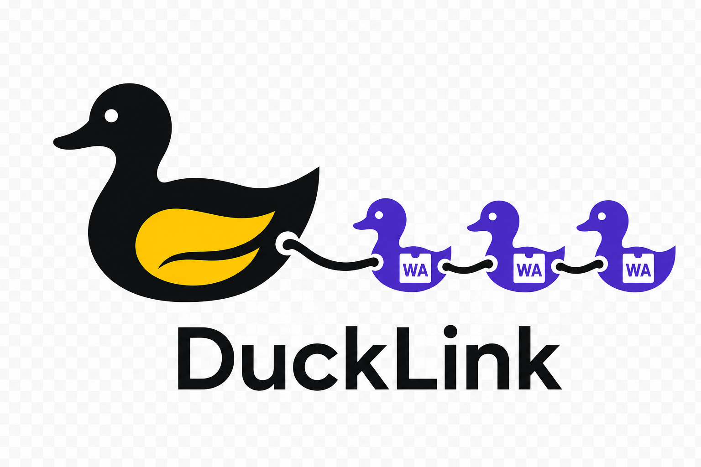

<p align="center">
  
</p>

# DuckDB WebAssembly Components

This repository contains a pair of WebAssembly components that wrap the DuckDB C API (`libduckdb`) and expose it through the Wasm component model.

- `duckdb-core-component`: Implements the `duckdb:component/database` world and provides structured access to DuckDB connections and SQL execution.
- `duckdb-cli-component`: Implements the `wasi:cli/run` world and offers a WASI-native command line interface that mirrors the behaviour of the native DuckDB shell while delegating database access through the component interface.

Both components are intended to run in preview2-capable runtimes such as `wasmtime 16.0+`.

## Repository layout

```
wit/
  core/                Shared database interface definitions
  standalone/          WASI-oriented worlds (standalone DB + CLI)
  browser/             Browser-oriented database world
crates/
  libduckdb-sys/       bindgen-based bindings to the DuckDB C API
  duckdb-core-component/ Component implementation of the DuckDB API
  duckdb-cli-component/ WASI CLI component built on top of the exported API
scripts/
  build-libduckdb-wasm.sh  Helper for cross-compiling DuckDB to wasm32-wasi
cmake/toolchains/
  wasi-sdk.cmake       Toolchain file for building DuckDB with wasi-sdk
```

## Prerequisites

1. **DuckDB source** at `DUCKDB_SOURCE_DIR` (e.g. `~/src/duckdb`). A shallow clone is sufficient:
   ```bash
   git clone https://github.com/duckdb/duckdb.git ~/src/duckdb
   ```
2. **wasi-sdk** (tested with 33.0; exception handling requires >= 33) with `WASI_SDK_PREFIX` pointing at the installation root. A predownloaded copy lives under `external/wasi-sdk-33.0-<platform>`; point the variable there if you do not have a global install.
3. **Rust tooling**:
   - `rustup target add wasm32-wasi`
   - `cargo install cargo-component`
4. **wit-bindgen tooling** (included automatically by `cargo-component`).

Network access is required only when fetching DuckDB or installing the toolchain.

## Building `libduckdb` for wasm32-wasi

The component links against a statically built `libduckdb` compiled for `wasm32-wasi`. Use the helper script to cross-compile the library:

```bash
export DUCKDB_SOURCE_DIR=~/src/duckdb
export WASI_SDK_PREFIX="$(pwd)/external/wasi-sdk-33.0-arm64-macos"
export WASI_TARGET_TRIPLE=wasm32-wasip2
export WASM_EXTENSIONS=json  # defaults to json if unset; comma‑separate to add more later
scripts/build-libduckdb-wasm.sh
```

The script places `libduckdb-wasi.a` under `artifacts/`. Afterwards set the following environment variables so the Rust build can locate the headers and the archive:

```bash
export DUCKDB_INCLUDE_DIR="$DUCKDB_SOURCE_DIR/src/include"
export DUCKDB_STATIC_LIB="$(pwd)/artifacts/libduckdb-wasi.a"
```

### Browser-oriented static library

For the browser component you will need a DuckDB archive compiled for the appropriate `wasm32-unknown-unknown` (or equivalent) target. Once built, point `DUCKDB_STATIC_LIB` at that archive and use the `make core-browser` target to produce `duckdb_core_component.wasm` with the `browser` feature enabled.

## Building the components

Compile both components using the make targets (they call `cargo component` under the hood):

```bash
make
```

Individual targets are also available:

```bash
make core
make duckdb-cli-component

# Build the browser-oriented core (requires a browser-compatible DuckDB static archive)
make core-browser BROWSER_TARGET=wasm32-unknown-unknown
```

The resulting component binaries are generated in `target/wasm32-wasi/release/`:

- `duckdb_core_component.wasm`
- `duckdb_cli_component.wasm`

## Developing component extensions

Extensions live under `extensions/<name>-component`, register imperatively in
`load()` against the `duckdb:extension` world, and are tracked by the tooling in
`tooling/` + `registry/` (mirrors `~/git/sqlite-wasm`'s system). The full
roadmap is in [PLAN-duckdb-extensions.md](PLAN-duckdb-extensions.md).

```bash
# Scaffold a skeleton (consults tooling/compat-registry.json for crate status,
# registers the workspace member, and cargo-checks that it compiles):
make ext-scaffold NAME=myext CRATE=base32,bs58

# Edit extensions/myext-component/src/lib.rs + smoke.sql, then build + smoke:
make ext NAME=myext-component

# Seed assertions from current output, review, and re-run to assert:
python3 tooling/smoke.py --seed-expected myext
python3 tooling/smoke.py myext

make ext-smoke-all        # smoke every extension
make ext-list-broken      # crates flagged un-buildable on wasm32-wasip2
python3 tooling/t-status.py   # tooling-improvement items from build experience
```

Extensions load through the **native host runner** (`ducklink`); the
wac-composed standalone CLI links a no-op loader stub and cannot instantiate
them. `isin` (hand-rolled) and `baseN` (crate-backed) are worked examples. See
[docs/component-extension-guide.md](docs/component-extension-guide.md) for the
capability surface and packaging details.

## Using the components

### Component worlds

- `wit/core/duckdb-core.wit` defines the shared `duckdb:component/database` interface implemented by the core component.
- `wit/standalone/duckdb-standalone.wit` exports the database world for WASI runtimes, while `wit/standalone/duckdb-cli.wit` wires in the CLI experience on top of it.
- `wit/browser/duckdb-browser.wit` will back the browser-friendly component variant, sharing the same database surface but relying on host-provided storage and networking.

### Direct database access

Instantiate the database component with a runtime that supports the component model. For example, using `wasmtime`:

```bash
wasmtime component run target/wasm32-wasi/release/duckdb_core_component.wasm --dir .
```

Pre-open directories that contain database files (e.g. `--dir .`) so the component can access them via WASI.

### CLI component

The CLI component imports the database world and exposes a `wasi:cli` entry point. To run it with wasmtime you can compose the CLI and core components using the [`wac`](https://github.com/bytecodealliance/wac) tool:

```bash
# Install the wac CLI once
cargo install wac-cli

# Compose the CLI + core component pair
wac plug target/wasm32-wasip2/release/duckdb_cli_component.wasm \
  --plug target/wasm32-wasip2/release/duckdb_core_component.wasm \
  -o artifacts/duckdb-cli.wasm

# Execute a query (grant directory access for any on-disk database file)
wasmtime run artifacts/duckdb-cli.wasm --dir . -- :memory: -c "select 42;"
```

For quick validation there is also a helper script that performs the `wac plug`
step and executes a simple query:

```bash
scripts/smoke-cli.sh
```

The script accepts optional environment variables (`SQL`, `DB_PATH`, `EXTRA_WASMTIME_FLAGS`, `EXTENSIONS`)
to tailor the smoke test.
For example, set `EXTENSIONS="sample_extension"` to pass `--load-extension sample_extension`
to the CLI before the query runs.

The CLI supports:

- Connecting to a database file or running purely in-memory (`duckdb_cli_component.wasm :memory:`)
- Executing a single command via `-c "SQL"`
- Preloading componentized extensions via `--load-extension <name>` (repeat for multiple extensions); this issues a `LOAD <name>` statement before user SQL runs
- Interactive REPL with `.help`, `.exit`, and `.quit`

Result sets are rendered in a text table that mirrors the native DuckDB shell.

### WIT packages

All WIT interfaces live under `wit/` at the repository root. That directory
vendors the WASI Preview 2 packages at version `0.2.6` (the latest preview
supported by Wasmtime `37.0.2`), along with the DuckDB-specific packages. The
crate-local copies under `crates/*/wit/` are generated from this canonical tree
via `scripts/sync-core-wit.sh` and `scripts/sync-cli-wit.sh`. Always edit the WIT
files in `wit/` first, then re-run the sync scripts to propagate changes before
building.

External extensions can depend on the definitions in `wit/duckdb-extension/`
to stay in sync with the host runtime without having to vendor their own copies
of the extension interfaces.

### Native host runner

The `duckdb-component-host` crate provides a reusable Wasmtime runner that composes the CLI
and core components along with the componentized extension loader. Build and execute it via:

```bash
cargo run -p duckdb-component-host --bin ducklink -- -- duckdb-cli :memory: -c "select 42 as answer;"
```

Additional directories can be exposed to the CLI with `--dir /host/path::/guest/path`, and
custom component artifacts can be supplied with `--core-component` / `--cli-component`. The
host automatically preopens the current working directory as `.` so relative database paths
continue to work.

### Extension components

DuckDB’s extension loader is in the process of resolving WebAssembly components from `artifacts/extensions/`. When an extension registers itself with the core component, the name is sanitized to `[A-Za-z0-9_-]` and mapped to `<name>.wasm` inside that directory. As the loader matures, dropping a compiled extension there will allow `LOAD <name>` to instantiate it through the preview2 runtime rather than the native shared-library path.

This repository ships a minimal sample extension under `extensions/sample-extension-component/` that exercises the component interface. You can build and validate it end-to-end via:

```bash
make smoke-extension
```

The target runs the `duckdb-component-host` test `load_sample_extension_component`, which:

1. Builds the sample extension (if it is not already present).
2. Copies the resulting component to `artifacts/extensions/sample_extension.wasm`.
3. Instantiates it with Wasmtime using the preview2 bindings and asserts that `load()` returns the expected metadata.

## Testing

Currently the project does not ship a full integration test suite because executing the components requires a preview2 runtime plus a wasm32-wasi build of DuckDB. Manual smoke testing can be done after building:

```bash
wasmtime component run artifacts/duckdb-cli.wasm --dir . -- in_memory_db.duckdb -c "select 42 as answer;"
```

There are also convenience targets:

```bash
make smoke-cli            # :memory: query via scripts/smoke-cli.sh
make smoke-cli-disk       # same but forces an on-disk temp database
make sample-extension     # builds the sample component and copies it to artifacts/extensions/
make smoke-extension      # runs Cargo test to build + load the sample extension component
```

To validate the preview2 filesystem adapter against real storage outside of `make`, set `ON_DISK_SMOKE=1` when running `scripts/smoke-cli.sh`; the helper will create a temporary on-disk database, grant Wasmtime access to that directory, and delete it after the query completes.

Continuous smoke coverage runs in CI via `.github/workflows/smoke-tests.yml`, which builds the components and executes both the in-memory and on-disk runs of `scripts/smoke-cli.sh` on every push and pull request.

### Running CI locally with act

Until hosted Actions are available (public repo / billing), the same workflow can
run locally with [nektos/act](https://github.com/nektos/act) in Docker:

```bash
brew install act          # one-time (Docker must be running)
make ci-local             # runs .github/workflows/smoke-tests.yml
scripts/ci-local.sh -l    # list jobs without running
```

`.actrc` maps `ubuntu-latest` to `catthehacker/ubuntu:act-latest` and enables
`--reuse` so caches persist between runs. The wasi-sdk download in the workflow
is architecture-aware (`x86_64`/`arm64`), so it runs natively under act on Apple
silicon as well as on GitHub's x86_64 runners. The first run is slow (it pulls
the runner image, compiles the component tooling, and builds the patched DuckDB
archive); afterwards the cached archive makes runs fast.

## Database interface

Beyond `execute` / `open-stream`, the `database` interface exposes:

- **Prepared statements** — `prepare(conn, sql)` returns a reusable
  `prepared-statement` resource; `execute(params)` binds positional parameters
  (`$1`, `$2`, ...) and runs it, rebinding from scratch each call.
- **Configuration** — `open-with-config(path, options)` opens a database applying
  `(name, value)` options (e.g. `access_mode`, `default_order`, `max_memory`).
- **Arrow** — `query-arrow(conn, sql)` returns the result as an Arrow IPC stream
  (`list<u8>`), decodable by any Arrow implementation (apache-arrow in JS,
  arrow-rs in Rust). Zero-copy is not possible across the component boundary, so
  buffers are serialized once into IPC bytes.

## Next steps

- Flesh out remaining CLI scripting parity with the native shell
- Resolve GitHub Actions billing so the smoke-tests workflow can run
